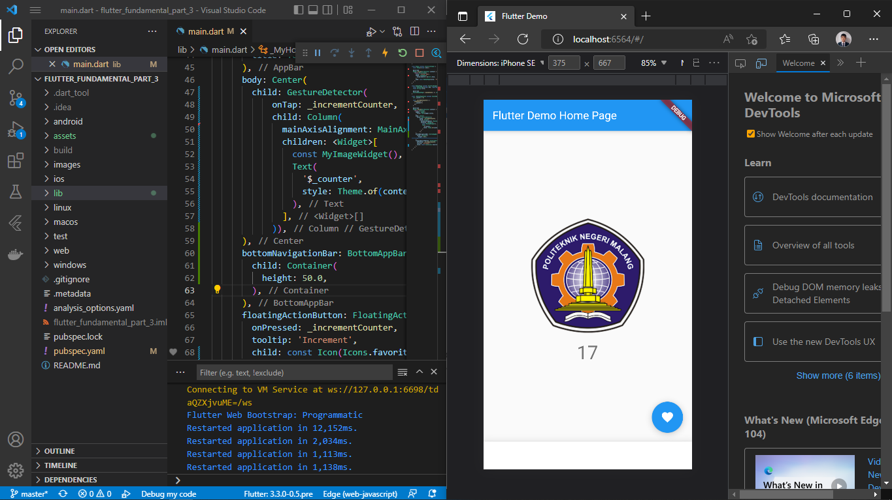
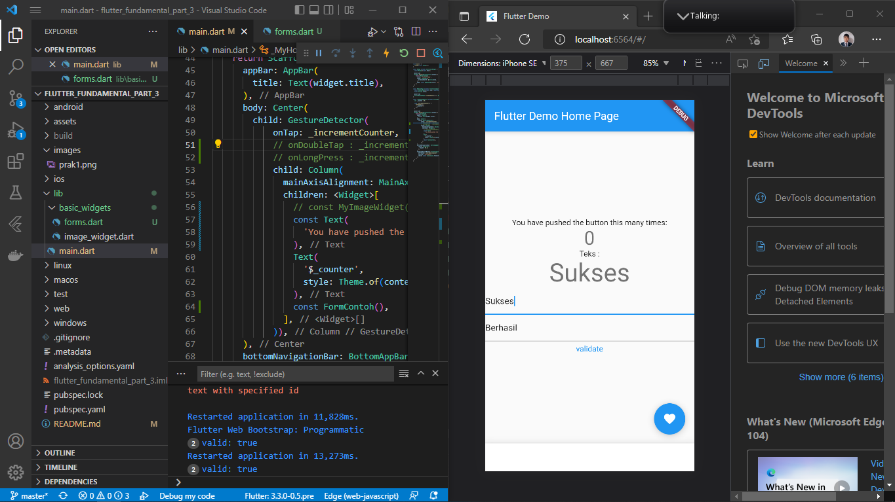
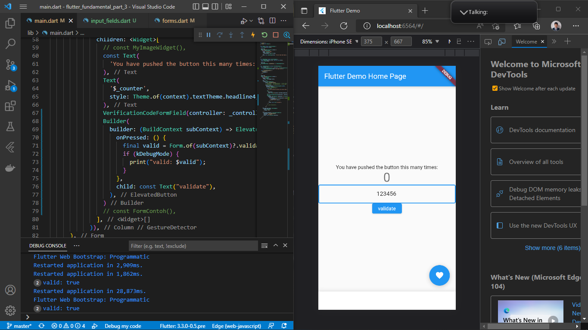

# TSA Mobile Pertemuan 16

## Praktikum 1: Menerapkan Gesture Detector

Pada gambar diatas menjelaskan bahwa gesture yang digunakan adalah onTap berfungsi ketika klik 1x bagian sekitar gambar maka angka yang tampil akan bertambah sesuai klik. Apabila menggunakan gesture onDoubleTap maka harus klik 2x agar angka dapat bertambah, dan gesture onLongPress maka harus klik + tahan agar angka dapat bertambah.
## Praktikum 2: Menerapkan Input Widget dan Forms

Pada gambar diatas menjelaskan bahwa inputan yang diketik akan tampil pada form serta terdapat validasi bahwa inputan tidak boleh kosong.
## Praktikum 3: Menerapkan Custom Input dan FormField Widget

Pada gambar diatas menjelaskan adanya custom input yang dimana inputan tersebut hanya diisi oleh angka saja tidak bisa diisi dengan huruf atau simbol apapun pada formfield. 

